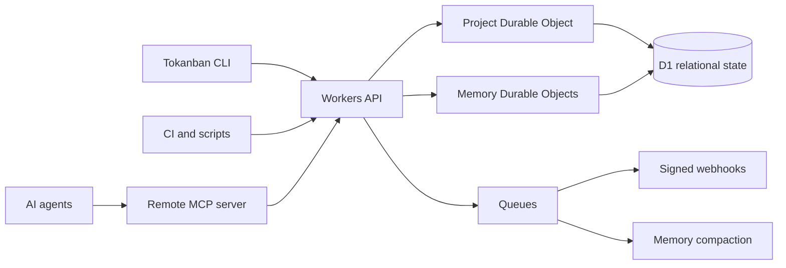

# Tokanban

Agent-first task management and durable memory for AI coding teams.

Tokanban gives Claude Code, Codex CLI, Cursor, OpenCode, CI bots, and custom MCP clients one shared work layer: tasks agents can update safely, memory agents can carry across sessions, and audit trails humans can trust.

<p align="center">
  <a href="https://tokanban.com"></a>
</p>

<p align="center">
  <a href="https://tokanban.com">Website</a> |
  <a href="https://app.tokanban.com/dashboard">Dashboard</a> |
  <a href="https://api.tokanban.com/mcp">MCP server</a> |
  <a href="https://github.com/emeraldsystems/tokanban/releases">Releases</a>
</p>

The animation above is a GitHub-safe SVG adaptation of the live terminal demo on [tokanban.com](https://tokanban.com). It uses no JavaScript, so it can render inside GitHub README views.

## Why Tokanban

Most project management tools were designed for humans clicking through a web UI. Their APIs exist, but they are usually secondary: optimistic assumptions, awkward auth, weak agent attribution, and painful concurrency behavior when multiple agents write at once.

Tokanban starts from the agent workflow:

- **MCP-native by default.** Agents can read projects, claim work, create tasks, update status, add comments, manage sprints, and inspect memory through a remote MCP endpoint.
- **CLI-first for developers.** Everything important is available from `tokanban`, with table/card output for humans and JSON for scripts.
- **Durable agent memory.** Facts, decisions, session chronicles, continuation prompts, and provenance persist across sessions, projects, machines, and workdirs.
- **Agents are real actors.** Scoped agent keys, role intersection, audit trails, and activity attribution make it clear which human or agent changed what.
- **Safe concurrent writes.** Project mutations are serialized behind Cloudflare Durable Objects, with ETags and idempotency keys for retry-safe automation.
- **Observable without becoming another UI chore.** The dashboard is for reading board state, activity, sprints, and memory, while agents and scripts do the work.

## Install

Install the latest CLI:

```sh
curl -fsSL https://app.tokanban.com/install.sh | sh
```

Or install from Cargo:

```sh
cargo install --locked tokanban
```

Pre-built binaries are published for Linux, macOS, and Windows on the [GitHub Releases](https://github.com/emeraldsystems/tokanban/releases) page. The install script downloads a matching binary when available and falls back to Cargo when needed.

## First Run

```sh
# Authenticate with Tokanban
tokanban auth login

# Pick a default project once
tokanban project list
tokanban project set PLAT

# Create and inspect work
tokanban task create "Fix auth token refresh" --priority high
tokanban task list
tokanban task view PLAT-42

# Update from your terminal or let an agent do it through MCP
tokanban task update PLAT-42 --status in_progress
tokanban comment add PLAT-42 "Found the refresh retry bug"
tokanban task close PLAT-42 --reason "Fixed"
```

## MCP Server

Tokanban's MCP server is remote. There is no local daemon to run.

```json
{
  "tokanban": {
    "type": "url",
    "url": "https://api.tokanban.com/mcp",
    "headers": {
      "Authorization": "Bearer <your-tokanban-api-key>"
    }
  }
}
```

Create a scoped key for an agent:

```sh
tokanban agent create "Codex" \
  --type codex \
  --scopes "tasks:read,tasks:write,comments:read,comments:write,projects:read,members:read,memory:read,memory:write"
```

Use tighter scopes for production bots. Agent permissions are intersected with workspace role permissions, so a key cannot exceed the authority of the user or member identity that owns it.

## Claude Code Plugin

Tokanban also ships as a Claude Code plugin marketplace. From inside Claude Code:

```text
/plugin marketplace add emeraldsystems/tokanban
/plugin install tokanban@tokanban
```

The plugin provides:

- **Setup skill** for CLI installation, auth, and MCP configuration.
- **Tokanban skill** for task, project, sprint, workflow, member, and agent-key commands.
- **Memory skill** for session start/end, durable-memory triage, and continuation discipline.
- **Hooks and templates** for Claude Code, Codex CLI, and Cursor behavior blocks.

The marketplace catalog is `.claude-plugin/marketplace.json`; plugin assets live in `plugins/tokanban/`.

## Agent Memory

Tokanban memory is designed for coding agents that need continuity across runs:

- **Facts:** durable project or codebase knowledge with confidence and provenance.
- **Decisions:** choices linked to supporting facts, so stale evidence can flag decisions for review.
- **Session chronicles:** structured handoffs containing completed work, remaining work, learned facts, and a continuation prompt.
- **Relevant-now retrieval:** memory can be partitioned by Tokanban project, local working directory, task, module, and file context.
- **Candidate triage:** the CLI can score and defer memory candidates before they become durable memory.

Local scoring example:

```sh
tokanban memory score --input '{
  "kind": "fact",
  "content": "Pages deploys must run from app/ so Wrangler includes Pages Functions.",
  "confidence": 0.95,
  "project_known": true,
  "workdir_known": true
}'
```

Deferred candidate workflow:

```sh
tokanban memory candidate add \
  --project-id <project-id> \
  --working-directory "$PWD" \
  --input '{"kind":"fact","content":"This may be useful next session."}'

tokanban memory candidate review \
  --project-id <project-id> \
  --working-directory "$PWD"
```

Durable memory reads and writes are exposed through MCP tools such as `session_start`, `memory_relevant_now`, `memory_create_fact`, `memory_create_decision`, `memory_search`, and `session_end`.

## Command Surface

```sh
# Tasks
tokanban task create "Implement pagination" --priority high
tokanban task list --status in_progress --format table
tokanban task view PLAT-42
tokanban task update PLAT-42 --status in_review
tokanban task search "auth refresh"
tokanban task close PLAT-42 --reason "Merged"

# Comments
tokanban comment add PLAT-42 "Root cause: stale refresh token cache"
tokanban comment list PLAT-42

# Sprints
tokanban sprint list
tokanban sprint create --name "Sprint 12" --start 2026-04-30 --end 2026-05-14

# Agent keys
tokanban agent create "CI Triage Bot" --scopes "tasks:read,tasks:write"
tokanban agent list
tokanban agent rotate <agent-id>

# Machine-readable output
tokanban task list --format json | jq '.items[] | {key,title,status}'
```

## Architecture

Tokanban runs on Cloudflare's edge stack:



The design goal is boring reliability for non-boring agent workflows: serialized writes, structured errors, retry-safe mutation paths, explicit scopes, and a durable record of what agents did and why.

## Links

- Website: [tokanban.com](https://tokanban.com)
- App: [app.tokanban.com](https://app.tokanban.com)
- MCP endpoint: `https://api.tokanban.com/mcp`
- API origin: `https://api.tokanban.com`
- Releases: [github.com/emeraldsystems/tokanban/releases](https://github.com/emeraldsystems/tokanban/releases)

## License

BSD-3-Clause

Copyright (c) 2026, Emerald Systems. All rights reserved.
